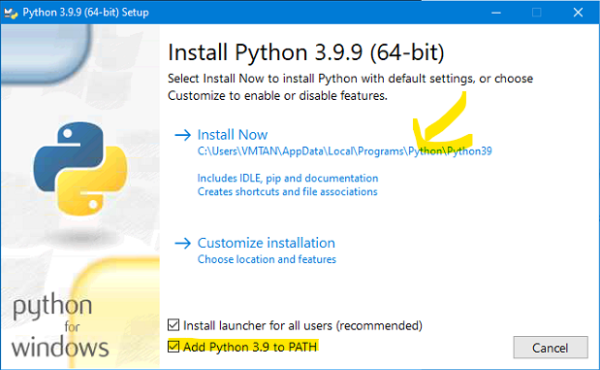

<b>1. Cài đặt python 3.9.9. Nhớ tích như hình bên dưới</b>

Link download: https://www.python.org/ftp/python/3.9.9/python-3.9.9-amd64.exe

<b>2. Giải nén và chạy file setup.bat trong thư mục setup. Quay lại 1 bước. tìm file Check Live Die Mail mở nó lên là được</b>

https://github.com/emga9xkc2/check-live-die-mail-release/archive/refs/heads/main.zip

<b>3. Hướng dẫn sử dụng</b>

<b>4. Thông tin phiên bản</b>

- v1.5
